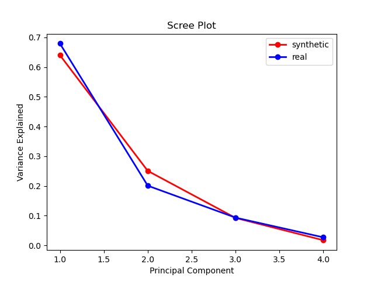
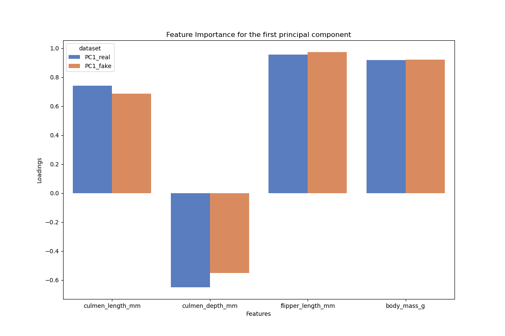
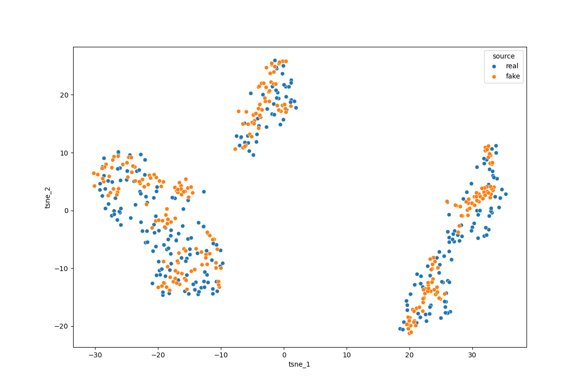

# Synthetic Data Generation 

This project explores the implementation of different techniques like **Generative Adversarial Networks (GANs)** , **Conditional Table GANs (CTGANs)** and more, sto generate synthetic data. The ultimate goal is to generate synthetic medical health records, but we start with simpler datasets like Iris flowers and penguin measurements to understand the fundamentals.

## Project Overview

### GAN/CTGAN
Generative Adversarial Networks (GANs) are a powerful machine learning framework consisting of two neural networks:
- **Generator**: Creates fake data from random noise
- **Discriminator**: Learns to distinguish between real and fake data

The two networks compete during training, improving both until the generator produces realistic synthetic data.

**Conditional Table GANs (CTGANs)** extend this concept specifically for tabular data, allowing for better generation of structured datasets with mixed data types (numerical, categorical).

### TableDiffusion
**TBD**

## Project Structure

```
├── ctgan_example.py              # Main: CTGAN implementation for penguins ⭐ (Wasserstein metrics from https://forkxz.github.io/blog/2024/Wasserstein/)
├── gan_example.py                # Basic GAN implementation with Iris dataset
├── gan_flowers.ipynb             # Comprehensive PyTorch tutorial and GAN for Iris flowers
├── penguin_conditional_prep.py   # Data preparation for conditional GAN with penguins
├── testplots.ipynb               # Visualization and comparison of synthetic vs real data
├── penguins_size.csv            # Original penguin dataset
├── penguins_fake.csv            # Generated synthetic penguin data
├── penguins_fake_real.CSV       # Combined real and synthetic data for comparison
├── generator.pth                # Trained generator model weights
├── libraries/
│   └── buildfhir.py             # FHIR-related utilities for health records
└── Tests/
│   └── ctganlibtest.py          # Tests for CTGAN functionality
│   └── plots.py                 # script for plotting the performance of the model
├── plots/
│   └── plotxy.png               # place for plots 
 
```

## Getting Started

### Prerequisites

- Python 3.8+
- PyTorch
- scikit-learn
- pandas
- numpy
- matplotlib & seaborn (for visualization)

### Installation

```bash
# Clone the repository (if applicable)
cd /path/to/SyntheticData

# Install required packages
pip install torch scikit-learn pandas numpy matplotlib seaborn
```

### Running the Examples

#### 1. Main: CTGAN with Penguins Dataset ⭐

```bash
python ctgan_example.py
```

**Features:**
- Loads the Palmer Penguins dataset
- Implements **Wasserstein Distance Metric** for better distribution comparison
- Uses **Conditional Table GAN** for mixed tabular data (numerical + categorical features)
- Generates synthetic penguin data maintaining species characteristics
- MinMax scaling for normalized feature generation
- Trains with adversarial loss and distribution matching
- Outputs: `penguins_fake.csv` and comparison data in `penguins_fake_real.CSV`

#### 2. Basic GAN with Iris Dataset

```bash
python gan_example.py
```

This script demonstrates:
- Data loading and preprocessing (scaling, one-hot encoding)
- Generator and Discriminator network definitions
- Training loop with adversarial loss (BCE Loss)
- Monitoring discriminator and generator loss

#### 3. Interactive Tutorial & Iris GAN

```bash
jupyter notebook gan_flowers.ipynb
```

This notebook provides:
- PyTorch fundamentals (tensors, autograd, optimization)
- Activation functions and loss functions
- Step-by-step implementation of neural networks
- Linear regression and logistic regression examples
- Iris GAN implementation with visualization

#### 4. Conditional GAN Preparation with Penguins

```bash
python penguin_conditional_prep.py
```

This script prepares conditional inputs for CTGAN:
- Loads and cleans the penguins dataset
- One-hot encodes categorical features (species, island, sex)
- Creates probabilistic distributions for conditional sampling
- Combines categorical conditions with noise vectors

#### 5. Visualization & Analysis

```bash
jupyter notebook testplots.ipynb
```

Visualization notebook for comparing synthetic vs. real data distributions

## Key Concepts

### GAN Training Dynamics

1. **Discriminator Training**: Learns to classify real vs. fake samples
2. **Generator Training**: Learns to fool the discriminator

The loss function used is **Binary Cross-Entropy (BCE)**:
- Real data → label 1
- Fake data → label 0

### Data Preprocessing

- **Scaling**: StandardScaler normalizes features to [-1, 1]
- **Encoding**: OneHotEncoder for categorical variables
- **Bootstrapping**: Data augmentation when sample size is small

### Noise Vector (Latent Vector)

The generator takes a random noise vector as input (typically 128 dimensions) and transforms it into realistic synthetic data.

## Dataset Information

### Iris Flower Dataset
- **Samples**: 150 (augmented to 1,500 via bootstrapping in examples)
- **Features**: 4 numerical (sepal length, sepal width, petal length, petal width)
- **Classes**: 3 species (Setosa, Versicolor, Virginica)

### Penguin Dataset (`penguins_size.csv`)
- **Samples**: 344 (after removing NaN values)
- **Numerical Features**: body_mass_g, flipper_length_mm, culmen_length_mm, culmen_depth_mm
- **Categorical Features**: species, island, sex

## Network Architectures

### Generator
```
Noise Vector  → Linear → BatchNorm1D → ReLU → Linear → BatchNorm1D → Linear → Sigmoid
```

### Discriminator
```
Input Features (7) → Linear → LazyBatchNorm → LeakyReLU → Linear → Sigmoid
```

**Note**: The Sigmoid(and also possible/supposed softmax) activation in the generator outputs ensures values are in [0, 1], matching MinMax scaled data range.

## Hyperparameters

Key hyperparameters used in the examples:

| Parameter | Value | Notes |
|-----------|-------|-------|
| Noise Dimension | 128 | Size of latent vector |
| Hidden Dimension | 64 | Neurons in hidden layers |
| Learning Rate | 0.001 | Adam optimizer |
| Epochs | 5000 | Training iterations |
| Adam Beta 1, 2 | 0.5, 0.999 | Momentum parameters |

## Training Tips

1. **Monitor Loss**: Both generator and discriminator losses should decrease over time
2. **Use Leaky ReLU**: In the discriminator to avoid vanishing gradients
3. **Batch Normalization**: Consider adding for more stable training
4. **Gradient Scaling**: Use `.detach()` when training only one network
5. **Wasserstein Distance**: Optionally use to evaluate similarity between real and synthetic data (included in comments)

## Evaluation Metrics

Potential metrics to evaluate synthetic data quality:

1. **Wasserstein Distance**: Measures distributional similarity
2. **PCA Comparison**: Visualize if synthetic data follows real data patterns
3. **Statistical Properties**: Compare mean, std, correlation matrices
4. **Discriminator Accuracy**: Can indicate data quality (should approach 50%)

## Results 🎉

### Synthetic Penguin Data Quality

The CTGAN model successfully generates synthetic penguin data that closely matches the distribution of real data:


**Legend:**
- **Blue dots/circles**: Real Adelie penguins
- **Orange dots/circles**: Real Gentoo penguins  
- **Green dots/circles**: Real Chinstrap penguins
- **Crosses (×)**: Synthetic fake data from CTGAN

The scatter plot shows that synthetic data (marked with ×) effectively matches the distribution patterns of real species data across both `culmen_length_mm` (beak length) and `flipper_length_mm` dimensions.

| Correlation map fake data                        | Correlation map real data
| ----------------------------------- | ----------------------------------- |
|  |  |


**Scree Plots**
Also interesting will be a comparison between the two scree-plots, which does show how many prinicpal components contribute in which magnitude for explaining the dataset.



as depicted in the graph the scree plots look very similar with just small differences.

**Feauture Importance**



as showed in the comparison for the loadings, there is a slightly difference in the feauture importance for the first principal component. This might be because either the training duration should be extended or the discriminator might not be strict enough. The second assumption could also explain the light missmatch in the comparison of the correlation matrices, because for the fake data some correlation values are very low.

**t-SNE Plot**



In this analysis, I utilized t-Distributed Stochastic Neighbor Embedding (t-SNE) to visualize the distribution of synthetic and real data. t-SNE is a powerful technique for dimensionality reduction that helps in visualizing high-dimensional datasets by mapping them to a lower-dimensional space.

The results showed that the synthetic data blend relative seamlessly with the real data, indicating that the generative model effectively captures the underlying distribution and characteristics of the real-world dataset. This close mixing suggests that the synthetic samples are qualitatively similar to the actual data, making them suitable for various applications.

### Synthetic medical Data 


## Project Status ✅

### Completed ✅
- ✅ Basic GAN implementation with Iris flowers
- ✅ PyTorch fundamentals and training pipeline
- ✅ CTGAN implementation for tabular data
- ✅ Wasserstein Distance metric for distribution comparison
- ✅ Penguin dataset generation and preprocessing
- ✅ Synthetic data generation and export
- ✅ Model serialization (generator.pth)
- ✅ Visual validation of synthetic data quality
- ✅ Data quality evaluation metrics
- ✅ PCA comparison of real vs synthetic distributions

### In Progress 🚀
- 🔄 search for a more complex but managable dataset
- 🔄 Fine-tuning hyperparameters for better generation

### Future Work 🔮
- [ ] CLEAN UP THE CODE !! 
- [ ] Update Readme (Project Strucutre explanation)
- [ ] Extend to medical health records 
- [ ] Implement FHIR integration for medical records
- [ ] Scale to larger datasets
- [ ] Add differential privacy mechanisms
- [ ] Implement Wasserstein GAN (WGAN) for better training stability
- [ ] Add evaluation metrics to default training metrics (Wasserstein distance, statistical tests)
- [ ] Create synthetic health data with proper privacy constraints
- [ ] Benchmark against CTGAN library implementations
- [ ] Handle missing data and imbalanced classes

## References

- [PyTorch Documentation](https://pytorch.org/docs/)
- [GAN Paper - Goodfellow et al.](https://arxiv.org/abs/1406.2661)
- [Conditional GAN (cGAN) Paper](https://arxiv.org/abs/1411.1784)
- [CTGAN: Effective Table Data Synthesizing](https://arxiv.org/abs/1907.00556)
- [Wasserstein Distance in GANs](https://forkxz.github.io/blog/2024/Wasserstein/)
- [FHIR Standard](https://www.hl7.org/fhir/)

## Project Goals Hierarchy

1. **Phase 1** ✓: Understand GAN fundamentals (Iris dataset)
2. **Phase 2** ✓ : Implement conditional GANs (Penguin dataset)
3. **Phase 3** (in progress) : make a YAML configurable CTGAN setup to work with any kind of datasets
4. **Phase 4** (planned) Try a generating synthetic data for a "real" and complex dataset 
5. **Phase 5** (planned) implement basic functionality for table diffusion data generation
6. **Phase 6** (planned) comparison between the two methods
7. **Phase 7** (planned) research and basic implementation of the most promising data generation method
8. **Phase 8** (optional): Generate synthetic medical health records in FHIR format

---

**Created**: January 2026  
**Status**: Active Development
